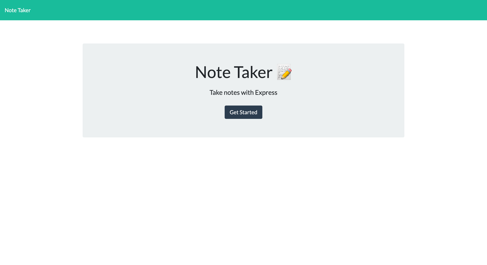
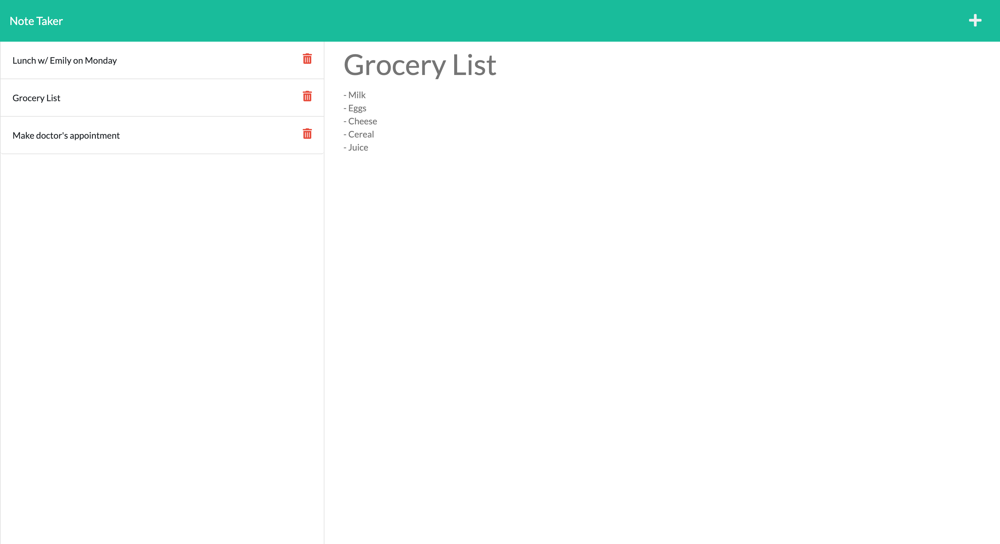

# note-taker

## Description

This is a note-taking application utilizing Express.js. It serves as a quick and convenient way for a user to store any kind of reminders and access them again at a later time.

## Table of Contents

- [Installation](#installation)
- [Tests](#tests)
- [Usage](#usage)
- [Credits](#credits)
- [License](#license)
- [Links](#links)
- [Screenshots](#screenshots)
- [Questions](#questions)

## Installation

To install this app on your local machine, first clone the repository:

HTTPS:

```
$ git clone https://github.com/liaobrien/note-taker.git
```

SSH:

```
$ git clone git@github.com:liaobrien/note-taker.git
```

Then cd into the cloned directory, and enter the following commands to initialize the app:

```
$ npm i
$ node server.js
```

## Tests

Use the follwing command to run tests:

```
$ npm run test
```

## Usage

This app can be accessed and used in the browser. The user is first presented with the home page, and after clicking "Get Started" they are taken to the application itself where they can enter new notes themselves. Clicking the save icon at the top right corner after filling both text fields saves their notes to the left-hand column, where they can access them again by clicking on them. The user can also delete old notes by clicking the trash can icon next to the note they wish to delete.

## Credits

All the front-end code in this app was provided by Trilogy Education Services.

## License

This project is licensed under the MIT license.

## Links

The deployed application can be viewed [here](https://pacific-hamlet-03759.herokuapp.com/).

## Screenshots





## Questions

If you have any questions about this repository, open an issue or contact me directly at liaobrien123@gmail.com. You can find more of my work at [liaobrien](https://github.com/liaobrien).
